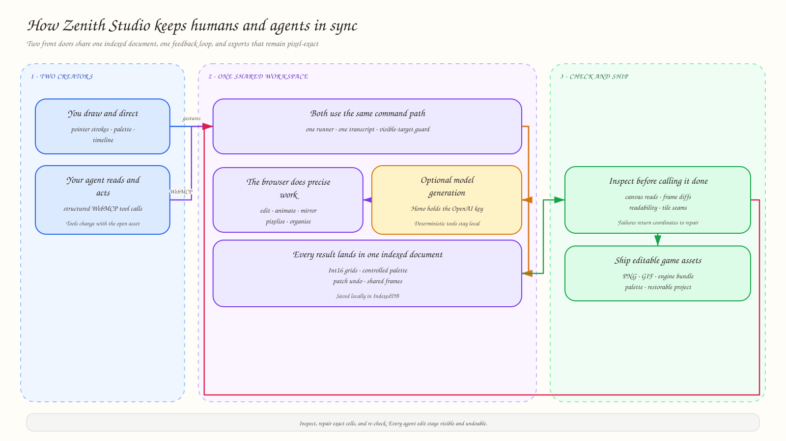

<p align="center">
  
</p>

<h1 align="center">Zenith Studio</h1>

<p align="center">
  A seamless way to generate, edit, animate, and ship game assets with Codex in the same workflow it already uses to write your game.
</p>

<p align="center">
  <strong><a href="https://zenith-web-mif2krwk2q-el.a.run.app">Open the live studio</a></strong>
  ·
  <a href="#run-locally">Run locally</a>
</p>

<!-- README-HACK:NEEDS-OWNER key="demo-video" instruction="Add the final public YouTube demo URL after replacing the four-minute cut with a version under three minutes." -->

## Codex writes the game. Zenith creates its world.

Codex is already helping you build the code. Zenith Studio lets it create the visual side of the game in that same workflow—and keeps every result open for you to edit.

Ask for a character, item, tile set, texture, animation, interface asset, or map. Codex can generate it inside the live studio, inspect the result, refine exact pixels, keep related assets consistent, and export everything for your engine. You and Codex work on the same canvas, so you can take over, adjust any detail, undo a change, or continue together.

## From an idea to game-ready assets

- **Generate a visual direction.** Turn a prompt or reference into editable characters, props, environments, tiles, and interface art.
- **Build complete game worlds.** Create coherent asset sets, directional views, animations, textures, tile sets, and maps in one project.
- **Edit everything.** Draw by hand or ask Codex to change a pose, palette, silhouette, frame, region, or individual pixel.
- **Keep the style consistent.** Reuse palettes and project style profiles across every asset.
- **Ship to the game.** Export PNGs, GIFs, engine bundles, palettes, or the complete restorable project.

## The result

The shipped showcase contains five characters and fifteen generated moves. Each animation is planned from its source sprite, drawn as a single sheet to preserve scale and registration, reduced into the character's indexed palette, and exported by the pipeline.

| Knight: overhead slash | Fire mage: fireball | Elf archer: draw and loose |
| :---: | :---: | :---: |
|  |  |  |

The editor also supports deterministic animation, direction mirroring, palette extraction and replacement, project style profiles, tile validation, and restorable project exports. These operations remain editable after they run; the generated image is never the end of the workflow.

## Why WebMCP fits

WebMCP lets Codex work inside the live studio instead of handing back a detached image. It can see the asset you have open, use Zenith Studio's real creative tools, inspect what changed, and keep refining until the result is ready.

Ask it to “make this knight face east,” “turn these tiles into a map,” or “animate this character and export the result.” Every action appears on your canvas, stays editable, and shares the same undo history as your own work.

Zenith Studio registers its tools through `document.modelContext.registerTool`. WebMCP and the built-in Agent Console use the same tool runner, document, and validation path.

## Architecture



The browser owns the artwork. `@zenith/core` is pure TypeScript with no DOM or framework dependency; it stores cells in `Int16Array` grids, validates mutations, and records undo as pixel patches rather than full snapshots. React subscribes to store revisions with `useSyncExternalStore`, allowing UI actions and agent calls to update the same mutable document safely.

IndexedDB saves assets and project structure locally without an account. The Hono service keeps the OpenAI key and model-backed generation, derivation, and chat routes on the server; it also exposes health and deterministic pixel endpoints. Editing, canvas rendering, project organization, local pixelisation, and export stay in the browser.

The checked-in Google Cloud Build pipeline builds and deploys both services to Cloud Run:

- **Web:** <https://zenith-web-mif2krwk2q-el.a.run.app>
- **API:** <https://zenith-api-mif2krwk2q-el.a.run.app>

## Built with

- TypeScript, React 19, and Next.js 16
- WebMCP via `document.modelContext.registerTool`
- Bun workspaces
- Hono and the OpenAI API
- IndexedDB, Canvas 2D, and Web Workers
- Google Cloud Build and Google Cloud Run

## Run locally

Requires Bun 1.3.14 or later.

```bash
bun run setup
bun run dev
```

Open <http://localhost:3000>. The first visit seeds example assets, and no login is required.

The core editor and deterministic tools work without the API service. To enable model-backed generation and chat, copy the API environment template and provide an OpenAI key:

```bash
cp apps/api/.env.example apps/api/.env
# Set OPENAI_API_KEY in apps/api/.env
```

Model generation can take minutes. The editor reports missing configuration clearly and prevents concurrent paid generation requests instead of silently queuing them.

## Test WebMCP

Use either environment:

- Open the live studio in ChatGPT's in-app browser; WebMCP is available there automatically.
- In Chrome 149 or later, enable `chrome://flags/#enable-webmcp-testing`, relaunch, and open an asset.

The Agent Console reports the detected WebMCP surface and registered tool count. Its built-in runner remains available when WebMCP is not present, using the same tool handlers for local testing.

## Verify the repository

```bash
bun test
bun run typecheck
bun run lint
bun run build
```

## Current boundaries

- Persistence is local to the browser through IndexedDB; there are no shared cloud projects or user accounts.
- Model-backed generation requires the deployed API or a local `OPENAI_API_KEY`.
- WebMCP requires ChatGPT's in-app browser or a compatible Chrome build with the testing flag enabled.

## License

Zenith Studio is available under the [MIT License](LICENSE). Copyright © 2026 Vimzh.
