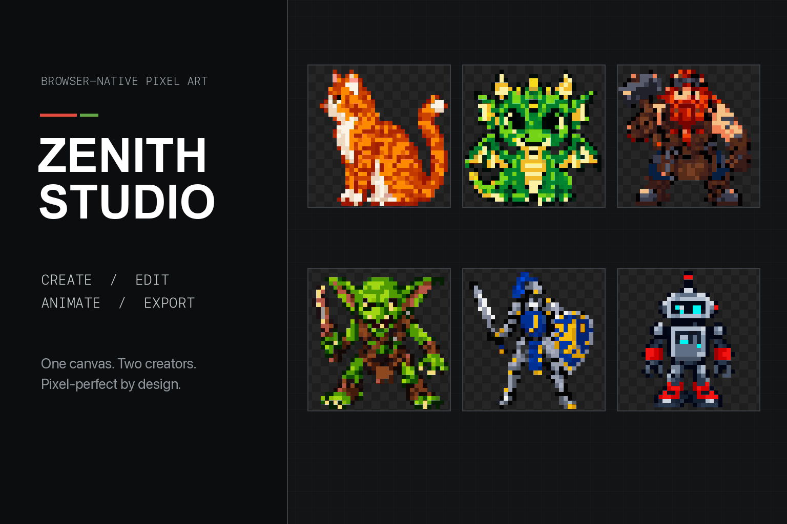
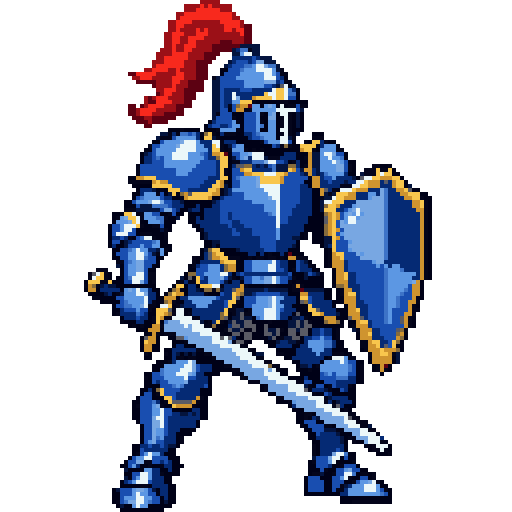
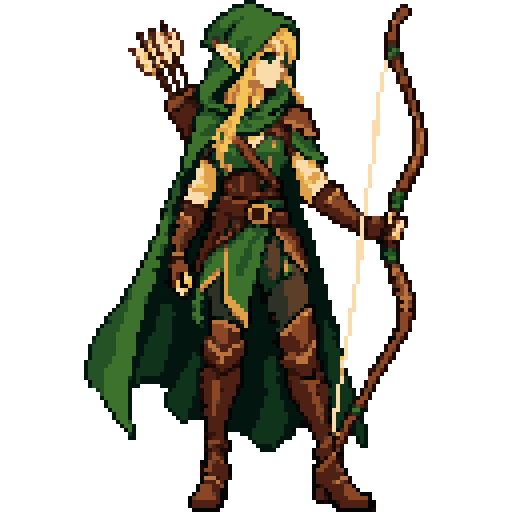

<p align="center">
  
</p>

<h1 align="center">Zenith Studio</h1>

<p align="center">
  A browser-native pixel-art studio where a person and an AI agent edit the same indexed canvas, share one undo history, and ship game-ready assets through WebMCP.
</p>

<p align="center">
  <strong><a href="https://zenith-web-mif2krwk2q-el.a.run.app">Open the live studio</a></strong>
  ·
  <a href="#run-locally">Run locally</a>
</p>

<!-- README-HACK:NEEDS-OWNER key="demo-video" instruction="Add the final public YouTube demo URL after replacing the four-minute cut with a version under three minutes." -->

## The idea

AI image generators can imitate pixel art, but their output usually breaks the constraints that make pixel art useful: exact cells, a controlled palette, hard alpha, aligned frames, and repeatable edits.

Zenith Studio makes those constraints the document model. A 32×32 sprite on a 16-colour palette becomes 1,024 indexed cells: `0`–`9` and `A`–`F` select colours, while `.` means transparent.

```text
................
......2222......
....22333322....
...2333333332...
...2331331332...
...2333333332...
...2333113332...
....23311332....
.....222222.....
......1111......
```

An agent can read this grid, reason about coordinates, change exact cells, inspect the result, and try again. It edits the canonical artwork instead of generating another approximation of it.

## What Zenith Studio does

- **Shares one canvas.** Human gestures and WebMCP calls reach the same document store and the same undo stack.
- **Keeps every edit pixel-exact.** Indexed palettes, integer coordinates, binary transparency, and nearest-neighbour rendering are enforced at the model boundary.
- **Lets agents inspect before editing.** Tools expose canvas regions, palettes, silhouettes, frame differences, and validation results as structured data.
- **Builds complete asset workflows.** Create and organize sprites, derive directions, animate frames, check tile seams, and export PNG, GIF, engine, palette, or project files.
- **Scopes tools to the current work.** The library exposes project operations; an open character adds direction and skeleton tools; a tile adds tiling tools.

```text
Prompt or existing sprite
          │
          ▼
 Human ── shared indexed canvas ── WebMCP agent
          │                         │
          └──── read → edit → check ┘
                    │
                    ▼
       PNG · GIF · engine bundle · project
```

## The result

The shipped showcase contains five characters and fifteen generated moves. Each animation is planned from its source sprite, drawn as a single sheet to preserve scale and registration, reduced into the character's indexed palette, and exported by the pipeline.

| Knight: overhead slash | Fire mage: fireball | Elf archer: draw and loose |
| :---: | :---: | :---: |
|  |  |  |

The editor also supports deterministic animation, direction mirroring, palette extraction and replacement, project style profiles, tile validation, and restorable project exports. These operations remain editable after they run; the generated image is never the end of the workflow.

## Why WebMCP fits

Most creative integrations stop at a prompt box. Zenith Studio exposes the application's real editing vocabulary, so the agent can participate in the same loop as the artist:

1. Read the open asset and its constraints.
2. Make a precise, named operation.
3. Inspect the changed pixels or frame diff.
4. Run a domain check such as readability, animation coherence, or tile continuity.
5. Repair only the coordinates that failed and export the result.

Tools register through `document.modelContext.registerTool`. A compatibility adapter also supports the earlier `navigator.modelContext` surface. Both WebMCP calls and the built-in Agent Console pass through the same runner, which records one transcript and refuses to edit when the visible route and active asset disagree.

## Architecture

```text
ChatGPT in-app browser / Chrome 149+
                 │ WebMCP
                 ▼
┌───────────────────────────────────────────────────────┐
│ Next.js web app · Google Cloud Run                    │
│                                                       │
│ Studio UI ── WebMCP runner ── scoped tool catalogue   │
│      │              │                                 │
│      └────── DocumentStore (@zenith/core) ────────────┤
│                     │                                 │
│            IndexedDB persistence                      │
│            Web Worker pixelisation                    │
└─────────────────────┬─────────────────────────────────┘
                      │ generation · chat · pixel API
                      ▼
          Hono API · Google Cloud Run
                      │
                      ▼
                  OpenAI API
```

The browser owns the artwork. `@zenith/core` is pure TypeScript with no DOM or framework dependency; it stores cells in `Int16Array` grids, validates mutations, and records undo as pixel patches rather than full snapshots. React subscribes to store revisions with `useSyncExternalStore`, allowing UI actions and agent calls to update the same mutable document safely.

IndexedDB saves assets and project structure locally without an account. The Hono service keeps the OpenAI key and model-backed generation, derivation, and chat routes on the server; it also exposes health and deterministic pixel endpoints. Editing, canvas rendering, project organization, local pixelisation, and export stay in the browser.

The checked-in Google Cloud Build pipeline builds and deploys both services to Cloud Run:

- **Web:** <https://zenith-web-mif2krwk2q-el.a.run.app>
- **API:** <https://zenith-api-mif2krwk2q-el.a.run.app>

## Built with

- TypeScript, React 19, and Next.js 16
- WebMCP via `document.modelContext.registerTool`
- Bun workspaces
- Hono and the OpenAI API
- IndexedDB, Canvas 2D, and Web Workers
- Google Cloud Build and Google Cloud Run

## Run locally

Requires Bun 1.3.14 or later.

```bash
bun run setup
bun run dev
```

Open <http://localhost:3000>. The first visit seeds example assets, and no login is required.

The core editor and deterministic tools work without the API service. To enable model-backed generation and chat, copy the API environment template and provide an OpenAI key:

```bash
cp apps/api/.env.example apps/api/.env
# Set OPENAI_API_KEY in apps/api/.env
```

Model generation can take minutes. The editor reports missing configuration clearly and prevents concurrent paid generation requests instead of silently queuing them.

## Test WebMCP

Use either environment:

- Open the live studio in ChatGPT's in-app browser; WebMCP is available there automatically.
- In Chrome 149 or later, enable `chrome://flags/#enable-webmcp-testing`, relaunch, and open an asset.

The Agent Console reports the detected WebMCP surface and registered tool count. Its built-in runner remains available when WebMCP is not present, using the same tool handlers for local testing.

## Verify the repository

```bash
bun test
bun run typecheck
bun run lint
bun run build
```

## Hackathon scope

Before the challenge, this repository contained a reusable landing-page and app-shell template. The indexed pixel model, canvas editor, WebMCP integration, agent console, generation and pixelisation pipeline, animation and direction workflows, project system, exports, showcase, and Cloud Run deployment were built for the WebMCP Challenge.

## Current boundaries

- Persistence is local to the browser through IndexedDB; there are no shared cloud projects or user accounts.
- Model-backed generation requires the deployed API or a local `OPENAI_API_KEY`.
- WebMCP requires ChatGPT's in-app browser or a compatible Chrome build with the testing flag enabled.

## License

Zenith Studio is available under the [MIT License](LICENSE). Copyright © 2026 Vimzh.
